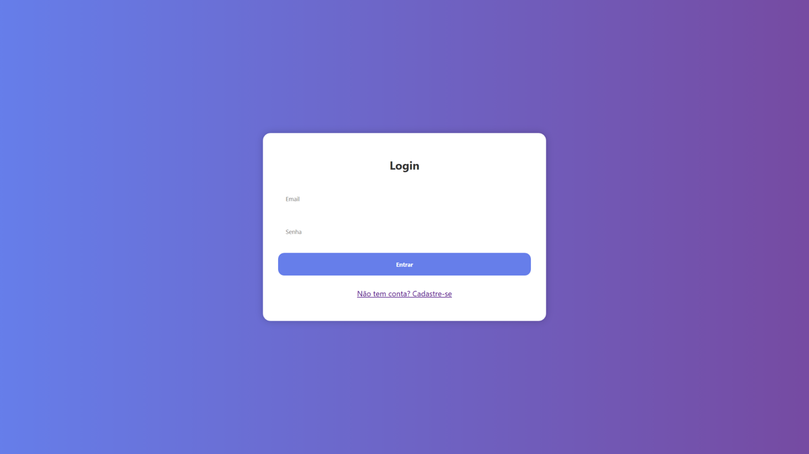
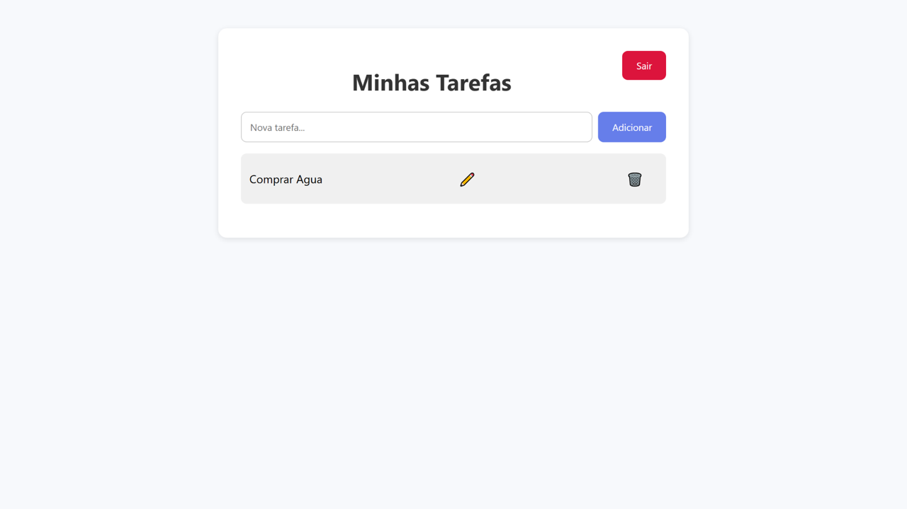
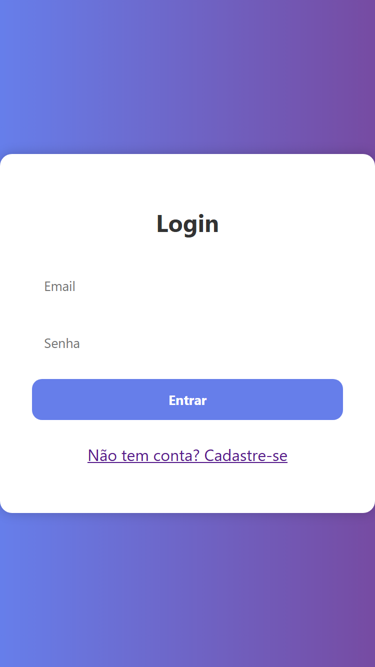
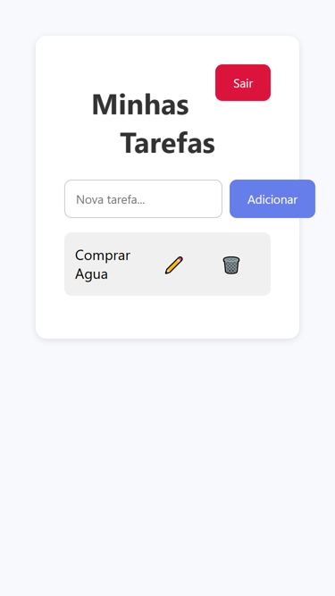

# FastTask - Frontend

🚀 Interface moderna e responsiva para o gerenciador de tarefas **FastTask**.

## 📱 Tecnologias Utilizadas

- HTML5
- CSS3 moderno e responsivo
- JavaScript (ES6+)
- Axios (para comunicação com o backend)
- Progressive Web App (PWA) ready

## 📸 Protótipos

### 🖥️ Versão Desktop
- Tela de Login: 
- Dashboard: 

### 📱 Versão Mobile
- Tela de Login: 
- Dashboard: 

## ⚙️ Funcionalidades

- Registro e autenticação de usuários
- Listagem, criação, edição e exclusão de tarefas
- Layout responsivo para desktop e mobile
- Compatível com instalação como PWA

## 🧪 Como Rodar

1. Basta entrar no link https://fasttaskfe.netlify.app
